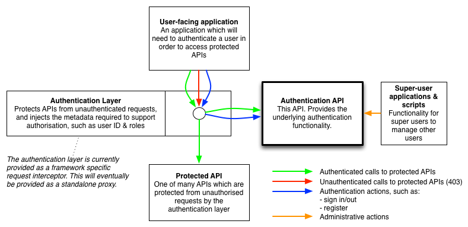
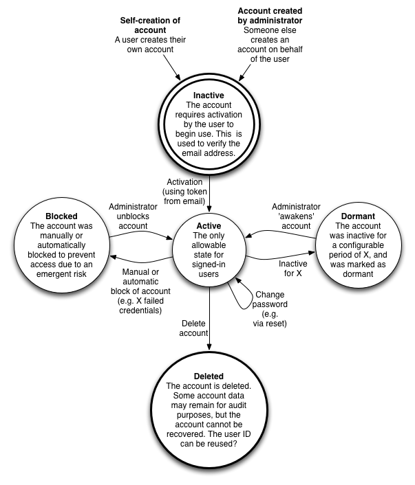

# devise_authentication_api

## High level design

An API to provide authenication functionality to a simple authentication layer. This 'layer' protects underlying APIs from unauthenticated access from user-facing applications, as shown below:

The authentication layer is intended to be a standalone reverse proxy. However, currently it is implemented as a [ruby/rack middleware application](https://github.com/ministryofjustice/x-moj-auth) and a PHP membrane application.

## User states

Each user is known to the authentication API, and can exist in a number of persistent states:

## User types

There is a hierarchical user model for the API, as follows:

* *Superuser*: a pseudo-user. Super users are all users of a separate management API. The separate management API should be accessed over a separate network to ensure that superuser actions are not available to any normal system users. There is no authentication for superusers, as access to the secure network is the authentication mechanism. A superuser is therefore 'anyone with access to the secure network'. Only superusers can create and manage administrators.
* *Administrator*: Administrators have the role 'administrator' and have the exclusive rights to manage all users except administrators. For example, an administrator can remove the account of a basic user. 
* *Basic*: all real users who are not administrators. These users can be self-created, but they cannot alter the data of any other user.

Note: Administrator is the only user type that equates to a role stored against the user account.

## Local installation

### Install mongodb

E.g. on mac osx:
> brew install mongodb

### Clone repo and install gems
> git clone https://github.com/ministryofjustice/devise_authentication_api.git

> cd devise_authentication_api

> bundle

### Create indexes
> bundle exec rake db:mongoid:create_indexes

### Run tests
> bundle exec guard

### Run server
> bundle exec rackup -p 9393

## Usage

*Note: API subject to change*

### Register user

    POST [host]/users

    # with JSON body:

    { "user": { "email": "joe.bloggs@example.com", "password": "s3kr!tpa55"} }

Success:

    201 Created

    {"email":"joe.bloggs@example.com","authentication_token":"Pm2tbZfcwfD7B1jK_wzo"}

Failure due to invalid parameters:

    422 Unprocessable Entity

    {"errors":{"email":["is invalid"],"password":["can't be blank"]}}

### Sign in user

    POST [host]/sessions

    # with JSON body:

    { "user": { "email": "joe.bloggs@example.com", "password": "s3kr!tpa55"} }

Success:

    201 Created

    {"email":"joe.bloggs@example.com","authentication_token":"Pm2tbZfcwfD7B1jK_wzo"}

Failure due to invalid credential(s):

    401 Unauthorized

    {"error":"Invalid email or password."}

### Verify user token

    GET [host]/users/[authentication_token]

Success:

    200 OK

    HTTP headers:

    X-USER-ID: joe.bloggs@example.com

Failure due to invalid token:

    401 Unauthorized

### Sign out user

    DELETE [host]/sessions/[token]

Success:

    204 No Content

Failure due to invalid token:

    401 Unauthorized

