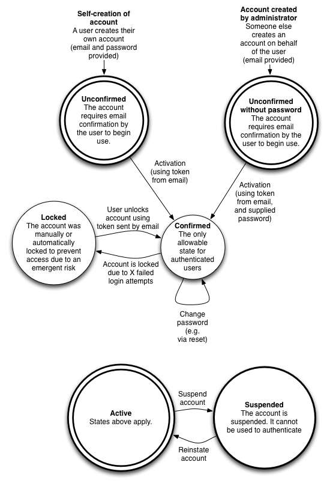

# devise_authentication_api

## User states

Each user is known to the authentication API, and can exist in a number of persistent states:

## Local installation

### Install mongodb

E.g. on mac osx:

    brew install mongodb

### Clone repo and install gems

    git clone https://github.com/ministryofjustice/devise_authentication_api.git

    cd devise_authentication_api

    bundle

### Create indexes

    bundle exec rake db:mongoid:create_indexes

### Run tests

    bundle exec guard

### Environment variables

Rails environment, for production

    RAILS_ENV=production

Or, development Rails environment

    RAILS_ENV=development

Or, test Rails environment

    RAILS_ENV=test

Email of initial admin user, an activation email will be sent to this address.

    INITIAL_ADMIN_USER_EMAIL=admin@example.com

For test and development environments, set initial admin password.

    TEST_INITIAL_ADMIN_PASSWORD=test1234

Number of authentication tries before locking an account.

    MAXIMUM_ATTEMPTS=5

Unlock strategy defines which strategy will be used to unlock an account.

    # email = Sends an unlock link to the user email
    # time  = Re-enables login after a certain amount of time (see UNLOCK_IN_SECS below)
    # both  = Enables both strategies
    # none  = No unlock strategy. You should handle unlocking by yourself via admin unlock action.

    # defaults to none
    UNLOCK_STRATEGY=none

Time interval in seconds to unlock the account, if unlock strategy is set to time

    UNLOCK_IN_SECS=86400

Sender email address for email 'from' field.

    SENDER_EMAIL_ADDRESS=test@example.com

Base URL for links in emails.

    SITE_URL=http://url_of_client_service.com

Secret key base.

    SECRET_KEY_BASE=generated_key

    e.g.
    irb
    require 'securerandom'
    generated_key=SecureRandom.hex(64)

If using sendgrid for email, these environment variables are used in config/environment.rb

    SENDGRID_PASSWORD=123456789
    SENDGRID_USERNAME=an@example.com
    SENDGRID_DOMAIN=heroku.com

### Run server
> bundle exec rackup -p 9393

## Usage

*Note: API subject to change*

### Admin registration of users

#### Admin user registers user

    POST [host]/admin/[admin_authentication_token]/users

    # with JSON body:

    { "user": { "email": "joe.bloggs@example.com" } }

Success:

    201 Created

    {"email":"joe.bloggs@example.com"}

    # Confirmation email is sent to "joe.bloggs@example.com" containing URL with confirmation_token.
    # If SITE_URL=http://url_of_client_service.com, then the confirmation URL in email looks like:

    http://url_of_client_service.com/users/confirmation/Ns5sRA1S7dcoEnm_Uaxt

    # if RAILS_ENV == 'test' then confirmation_token is included in response for test purposes
    # e.g.
    # {
    #     "email":"joe.bloggs@example.com",
    #     "confirmation_token_for_tests_only": "Pm2tbZfcwfD7B1jK_wzo"
    # }

Failure due to invalid admin authentication_token:

    401 Unauthorized

    '{"error":"Invalid token."}'

Failure due to invalid email:

    422 Unprocessable Entity

    {"errors":{"email":["is invalid"]}}

Failure due to admin account suspended:

    403 Forbidden

    {"error":"Your account is suspended."}

#### Activate registration

    POST [host]/users/activation/[confirmation_token]

    # with JSON body:

    { "user": { "password": "s3kr!tpa55" } }

Success:

    204 No Content

Failure due to invalid confirmation_token:

    401 Unauthorized

    '{"error":"Invalid token."}'

Failure due to invalid password:

    422 Unprocessable Entity

    {"errors":{"password":["is too short (minimum is 8 characters)"]}}

Failure due to user account suspended:

    403 Forbidden

    {"error":"Your account is suspended."}

### Self registration (for use by public-facing applications)

#### Register user

    POST [host]/users

    # with JSON body:

    { "user": { "email": "joe.bloggs@example.com", "password": "s3kr!tpa55"} }

Success:

    201 Created

    {"email":"joe.bloggs@example.com","confirmation_token":"b614285c-6a10"}

Failure due to invalid parameters:

    422 Unprocessable Entity

    {"errors":{"email":["is invalid"],"password":["can't be blank"]}}

#### Confirm registration

    POST [host]/users/confirmation/[confirmation_token]

Success:

    204 No Content

Failure due to invalid parameters:

    401 Unauthorized

    '{"error":"Invalid token."}'

Failure due to user account suspended:

    403 Forbidden

    {"error":"Your account is suspended."}

### Sign in user

    POST [host]/sessions

    # with JSON body:

    { "user": { "email": "joe.bloggs@example.com", "password": "s3kr!tpa55"} }

Success:

    201 Created

    {"email":"joe.bloggs@example.com","authentication_token":"Pm2tbZfcwfD7B1jK_wzo"}

Failure due to invalid credential(s):

    401 Unauthorized

    {"error":"Invalid email or password."}

Failure after > MAXIMUM_ATTEMPTS failed attempts results in locked account:

    403 Forbidden

    {"error":"Your account is locked."}

Failure due to user account suspended:

    403 Forbidden

    {"error":"Your account is suspended."}

### Unlock locked user account

After > MAXIMUM_ATTEMPTS failed attempts at signin due to incorrect password being supplied,
user account is locked.

An unlock email is sent to the user with a URL containing an unlock_token.

If SITE_URL=http://url_of_client_service.com, then the unlock URL in email looks like:

    http://url_of_client_service.com/users/unlock/Ns5sRA1S7dcoEnm_Uaxt

To unlock via API

    POST [host]/users/unlock/:unlock_token

Success:

    204 No Content

Failure due to invalid token:

    401 Unauthorized

    '{"error":"Invalid token."}'

Failure due to user account suspended:

    403 Forbidden

    {"error":"Your account is suspended."}

### Verify user token

    GET [host]/users/[authentication_token]

Success:

    200 OK

    HTTP headers:

    X-USER-ID: joe.bloggs@example.com

Failure due to invalid token:

    401 Unauthorized

Failure due to user account suspended:

    403 Forbidden

    {"error":"Your account is suspended."}

### Reset password

#### Request reset email

    POST [host]/users/password

    # with JSON body:

    { "user": { "email": "joe.bloggs@example.com" } }

    # Reset email is sent to "joe.bloggs@example.com" containing URL with reset_token.
    # If SITE_URL=http://url_of_client_service.com, then the reset URL in email looks like:

    http://url_of_client_service.com/users/password/Ns5sRA1S7dcoEnm_Uaxt

#### Reset email with token

    PATCH [host]/users/password/[reset_password_token]

    # with JSON body:

    { "user": { "password": "n3w-s3kr!tpa55" } }

Success:

    204 No Content

Failure due to invalid reset_token:

    401 Unauthorized

    '{"error":"Invalid token."}'

Failure due to invalid password:

    422 Unprocessable Entity

    {"errors":{"password":["is too short (minimum is 8 characters)"]}}

Failure due to user account suspended:

    403 Forbidden

    {"error":"Your account is suspended."}

### User change password when signed in

    PATCH [host]/users/[authentication_token]

    # with JSON body:

    { "user": { "password": "n3w-s3kr!tpa55" } }

Success:

    204 No Content

Failure due to invalid authentication_token:

    401 Unauthorized

    '{"error":"Invalid token."}'

Failure due to invalid password:

    422 Unprocessable Entity

    {"errors":{"password":["is too short (minimum is 8 characters)"]}}

Failure due to user account suspended:

    403 Forbidden

    {"error":"Your account is suspended."}

### Sign out user

    DELETE [host]/sessions/[token]

Success:

    204 No Content

Failure due to invalid token:

    401 Unauthorized

Failure due to user account suspended:

    403 Forbidden

    {"error":"Your account is suspended."}

Failure due to user account suspended:

    403 Forbidden

    {"error":"Your account is suspended."}

### Admin views user's statuses

    GET [host]/admin/[admin_authentication_token]/users?email=[email]

Success:

    200 OK

    {"email":"joe.bloggs@example.com","suspended":"true","is_admin_user":"false"}

Failure due to invalid user:

    422 Unprocessable Entity

    {"error":"no user found for email"}

Failure due to invalid token:

    401 Unauthorized

    '{"error":"Invalid token."}'

Failure due to admin account suspended:

    403 Forbidden

    {"error":"Your account is suspended."}

### Admin sets user's statuses

#### Admin unlock user account

    POST [host]/admin/[admin_authentication_token]/users/unlock

    with JSON body

    { "user": { "email":"joe.bloggs@example.com"}}

#### Suspend user account

    POST [host]/admin/[admin_authentication_token]/users/suspend

    # with JSON body

    { "user": { "email":"joe.bloggs@example.com"}}

#### Reinstate user account

    DELETE [host]/admin/[admin_authentication_token]/users/suspend

    # with JSON body

    { "user": { "email":"joe.bloggs@example.com"}}

#### Add admin rights to user

    POST [host]/admin/[admin_authentication_token]/users/admin_user

    # with JSON body

    { "user": { "email":"joe.bloggs@example.com"}}

#### Remove admin rights from user

    DELETE [host]/admin/[admin_authentication_token]/users/admin_user

    # with JSON body

    { "user": { "email":"joe.bloggs@example.com"}}

Success:

    204 No Content

Failure due to invalid user:

    422 Unprocessable Entity

    {"error":"No user found for email."}

Failure due to invalid token:

    401 Unauthorized

    '{"error":"Invalid token."}'

Failure due to admin account suspended:

    403 Forbidden

    {"error":"Your account is suspended."}

## High level design (proposed - not all implemented yet)

An API to provide authenication functionality to a simple authentication layer. This 'layer' protects underlying APIs from unauthenticated access from user-facing applications, as shown below:

The authentication layer is intended to be a standalone reverse proxy. However, currently it is implemented as a [ruby/rack middleware application](https://github.com/ministryofjustice/x-moj-auth) and a PHP membrane application.

